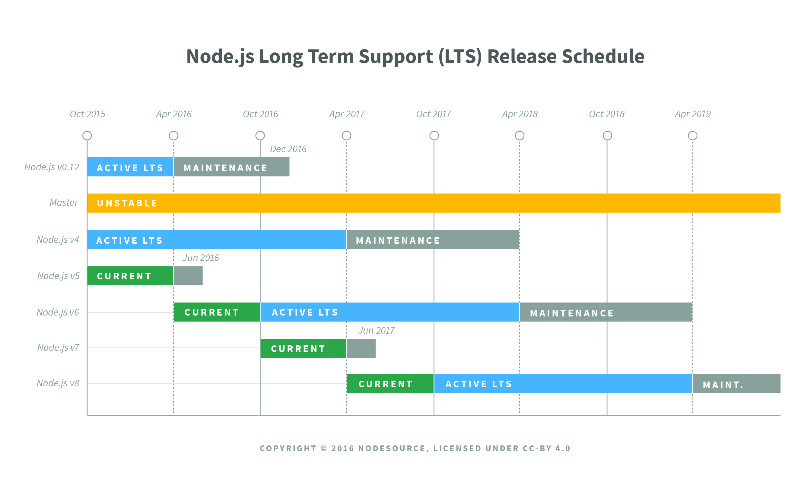

# Node.js Release Working Group

## Release schedule

| Release | Status              | Codename   |Initial Release | Active LTS Start | Maintenance LTS Start | End-of-life               |
| :--:    | :---:               | :---:      | :---:          | :---:            | :---:                 | :---:                     |
| [6.x][] | **Active LTS**      | [Boron][]  | 2016-04-26     | 2016-10-18       | 2018-04-30            | April 2019                |
| [8.x][] | **Active LTS**      | [Carbon][] | 2017-05-30     | 2017-10-31       | April 2019            | December 20191 |
| 9.x     |                     |            | 2017-10-01     |                  |                       | June 2018                 |
| 10.x    | **Current Release** | Dubnium    | 2018-04-24     | October 2018     | April 2020            | April 2021                |
| 11.x    | **Pending**         |            | 2018-04-23     |                  |                       | June 2019                 |

Dates are subject to change.

* 1: The 8.x *Maintenance* LTS cycle is currently scheduled to expire
  early on December 31, 2019 to align with the scheduled End-of-Life of
  OpenSSL-1.0.2.

The Release schedule is available also as a [JSON][] file. There is
also a live [Google Calendar][] that may be subscribed to. The Release schedule
is generated using the [lts module][].

### End-of-Life Releases

| Release | Status              | Codename   |Initial Release | Active LTS Start | Maintenance LTS Start | End-of-life               |
| :--:    | :---:               | :---:      | :---:          | :---:            | :---:                 | :---:                     |
| v0.10.x | **End-of-Life**     | -          | 2013-03-11     | -                | 2015-10-01            | 2016-10-31                |
| v0.12.x | **End-of-Life**     | -          | 2015-02-06     | -                | 2016-04-01            | 2016-12-31                |
| [4.x][] | **End-of-Life**     | [Argon][]  | 2015-09-08     | 2015-10-01       | 2017-04-01            | 2018-04-30                |
| 5.x     | **End-of-Life**     |            | 2015-10-29     |                  |                       | 2016-06-30                |
| 7.x     | **End-of-Life**     |            | 2016-10-25     |                  |                       | 2017-06-30                |

## Mandate

The Release working group's purpose is:

* Management/execution of the release and support process for all releases.

Its responsibilities are:

* Define the release process.
* Define the content of releases.
* Generate and create releases.
* Test Releases
* Manage the LTS and Current branches including backporting changes to
  these branches.
* Define the policy for what gets backported to release streams.

The Release working group is structured into teams and membership in
the working group does not automatically result in membership in these
teams. These teams are:

* Releasers team
* LTS team
* CITGM team

The `releasers` team is entrusted with the secrets and CI access to be able
build and sign releases. **Additions to the releasers team must be approved
by the TSC.**

The Long Term Support (LTS) team manages the process/content of LTS releases
and the required backporting for these releases. Additions to the LTS
team needs sign off from the rest of the LTS team.

The Canary in the Gold Mine (CITGM) team maintains CITGM as one of
the key sanity checks for releases. This team maintains the CITGM
repository and works to keep CITGM builds running and passing regularly.
This also includes maintaining the CI jobs in collaboration with the Build
Working Group.

## Release Plan

New semver-major releases of Node.js are cut from `master` every six months.
New even-numbered versions (e.g. v6, v8, v10, etc) are cut in April. New
odd-numbered versions (e.g. v5, v7, v9) are cut in October.

When a new *odd-numbered* major release is cut, the previous *even-numbered*
major version transitions to the Long Term Support plan.

Every major version covered by the LTS plan will be actively maintained for a
period of 18 months from the date it enters LTS coverage. Following those 18
months of active support, the major version will transition into "maintenance"
mode for 12 additional months.

The exact date that a release stream will be moved to LTS, moved between LTS
modes, or deprecated will be chosen no later than the first day of the month.
If it is to be changed, it will be done with no less than 14 days notice.

Given this schedule, there will be no more than two active LTS releases at any
given time, overlapping for a maximum period of six months.

Once a major version enters LTS coverage, new features (semver-minor) may only
be landed with consent of the Release working group. No semver-major
changes other than those required for critical security fixes may be landed.

Changes in an LTS-covered major version are limited to:

1. Bug fixes;
2. Security updates;
3. Non-semver-major npm updates;
4. Relevant documentation updates;
5. Certain performance improvements where the risk of breaking existing
   applications is minimal;
6. Changes that introduce large amount of code churn where the risk of breaking
   existing applications is low and where the change in question may
   significantly ease the ability to backport future changes due to the
   reduction in diff noise.

Generally changes are expected to live in a *Current* release for at least 2
weeks before being backported. It is possible for a commit to land earlier at
the discretion of the Release working group and the maintainers of the LTS branches.

Once a release moves into Maintenance mode, only ***critical*** bugs,
***critical*** security fixes, and documentation updates will be permitted.

Note that while it is possible that critical security and bug fixes may lead to
*semver-major* changes landing within an LTS stream, such situations will be
rare and will land as *semver-minor* bumps in the LTS covered version.

All LTS releases will be assigned a codename. A list of expected upcoming
codenames is available in [CODENAMES.md](./CODENAMES.md).

An odd-numbered major release will cease to be actively updated when the
subsequent even-numbered major release is cut.

### LTS Staging Branches

Every LTS major version has two branches in the GitHub repository: a release
branch and a staging branch. The release branch is used to cut new releases.
Only members of the release team should land commits into the release branch.
The staging branch is used to land cherry-picked or backported commits from
master that need to be included in a future release.

For example, for Node.js v4, there is a `v4.x` branch and a `v4.x-staging`
branch. When commits land in master that must be cherry-picked for a future
Node.js v4 release, those must be landed into the `v4.x-staging` branch. When
commits are backported for a future Node.js v4 release, those must come in the
form of pull requests opened against the `v4.x-staging` branch. **Commits are
only landed in the `v4.x` branch when a new `v4.x` release is being prepared.**

### Node abstraction layer

It should be stated that the abstraction layer (currently [`NAN`][]) should
support all *current* LTS releases. Given that Active LTS will overlap
for a period of 6 months, this means that the abstraction layer will, at
any given point in time, fully support a maximum of 2 LTS releases.

[Argon]: https://nodejs.org/download/release/latest-argon/
[Boron]: https://nodejs.org/download/release/latest-boron/
[Carbon]: https://nodejs.org/download/release/latest-carbon/
[4.x]: https://nodejs.org/download/release/latest-v4.x/
[6.x]: https://nodejs.org/download/release/latest-v6.x/
[8.x]: https://nodejs.org/download/release/latest-v8.x/
[Google Calendar]: https://calendar.google.com/calendar/ical/eln7trd6k7n6asgg49bu2vqn4s%40group.calendar.google.com/public/basic.ics
[JSON]: schedule.json
[lts module]: https://www.npmjs.com/package/lts
[`NAN`]: https://github.com/nodejs/nan

The working group members are the union of the LTS, Releasers
and CITGM team members listed below.

## LTS Team members
- [@Fishrock123](https://github.com/Fishrock123) - Jeremiah Senkpiel
- [@MylesBorins](https://github.com/MylesBorins) - Myles Borins
- [@gibfahn](https://github.com/gibfahn) - Gibson Fahnestock
- [@mhdawson](https://github.com/mhdawson) - Michael Dawson
- [@sam-github](https://github.com/sam-github) - Sam Roberts

### Releasers team
- [@Fishrock123](https://github.com/Fishrock123) - Jeremiah Senkpiel
- [@MylesBorins](https://github.com/MylesBorins) - Myles Borins
- [@cjihrig](https://github.com/cjihrig) - Colin Ihrig
- [@evanlucas](https://github.com/evanlucas) - Evan Lucas
- [@gibfahn](https://github.com/gibfahn) - Gibson Fahnestock
- [@italoacasas](https://github.com/italoacasas) - Italo A. Casas
- [@jasnell](https://github.com/jasnell) - James M Snell
- [@rvagg](https://github.com/rvagg) - Rod Vagg

### CITGM team
- [@MylesBorins](https://github.com/MylesBorins) - Myles Borins
- [@al-k21](https://github.com/al-k21) - Oleksandr Kushchak
- [@bengl](https://github.com/bengl) - Bryan English
- [@bzoz](https://github.com/bzoz) - Bartosz Sosnowski
- [@gdams](https://github.com/gdams) - George Adams
- [@gibfahn](https://github.com/gibfahn) - Gibson Fahnestock
- [@richardlau](https://github.com/richardlau) - Richard Lau
- [@targos](https://github.com/targos) - Michaël Zasso

### Emeritus

#### LTS Team members
- [@jasnell](https://github.com/jasnell) - James M Snell

#### CITGM team
- [@jasnell](https://github.com/jasnell) - James M Snell
