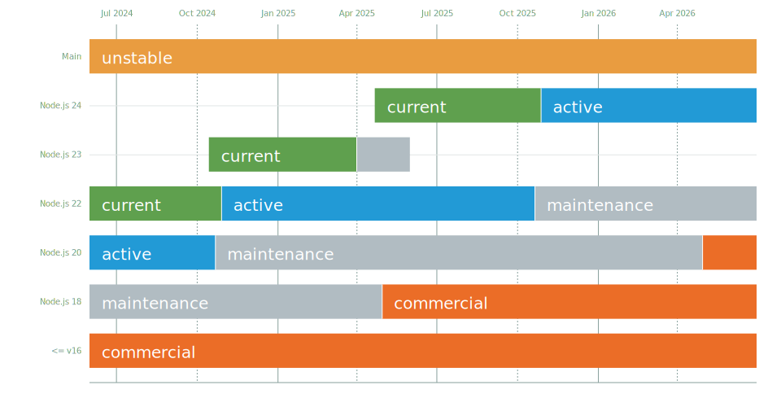

# Node.js Release Working Group

## Release schedule

| Release  | Status              | Codename    |Initial Release | Active LTS Start | Maintenance Start | End-of-life               |
| :--:     | :---:               | :---:       | :---:          | :---:            | :---:             | :---:                     |
| [10.x][] | **Maintenance**     | [Dubnium][] | 2018-04-24     | 2018-10-30       | 2020-05-19        | 2021-04-30                |
| [12.x][] | **Maintenance**     | [Erbium][]  | 2019-04-23     | 2019-10-21       | 2020-11-30        | 2022-04-30                |
| [14.x][] | **Active LTS**      | [Fermium][] | 2020-04-21     | 2020-10-27       | 2021-10-19        | April 2023                |
| 15.x     | **Current**         |             | 2020-10-20     | -                | 2021-04-01        | 2021-06-01                |
| 16.x     | **Pending**         |             | 2021-04-20     | 2021-10-26       | 2022-10-18        | 2024-04-30                |

Dates are subject to change.

The Release schedule is available also as a [JSON][] file.

### Release Phases

There are three phases that a Node.js release can be in: 'Current', 'Active
Long Term Support (LTS)', and 'Maintenance'. Odd-numbered release lines are not
promoted to LTS - they will not go through the 'Active LTS' or 'Maintenance'
phases.

 * Current - Should incorporate most of the non-major (non-breaking)
 changes that land on `nodejs/node` master branch.
 * Active LTS - New features, bug fixes, and updates that have been audited by
 the LTS team and have been determined to be appropriate and stable for the
 release line.
 * Maintenance - Critical bug fixes and security updates. New features may be
 added at the discretion of the LTS team - typically only in cases where
 the new feature supports migration to later release lines.

Changes required for critical security and bug fixes may lead to *semver-major*
changes landing within a release stream, such situations will be rare and will
land as *semver-minor*.

The term 'supported release lines' will be used to refer to all release lines
that are not End-of-Life.

### End-of-Life Releases

|  Release |      Status     |  Codename | Initial Release | Active LTS Start | Maintenance LTS Start | End-of-life |
|:--------:|:---------------:|:---------:|:---------------:|:----------------:|:---------------------:|:-----------:|
|  v0.10.x | **End-of-Life** |     -     |    2013-03-11   |         -        |       2015-10-01      |  2016-10-31 |
|  v0.12.x | **End-of-Life** |     -     |    2015-02-06   |         -        |       2016-04-01      |  2016-12-31 |
|  [4.x][] | **End-of-Life** | [Argon][] |    2015-09-08   |    2015-10-01    |       2017-04-01      |  2018-04-30 |
|  [5.x][] | **End-of-Life** |           |    2015-10-29   |         -        |                       |  2016-06-30 |
|  [6.x][] | **End-of-Life** | [Boron][] |    2016-04-26   |    2016-10-18    |       2018-04-30      |  2019-04-30 |
|  [7.x][] | **End-of-Life** |           |    2016-10-25   |         -        |                       |  2017-06-30 |
|  [8.x][] | **End-of-Life** | [Carbon][]|    2017-05-30   |    2017-10-31    |       2019-01-01      |  2019-12-31 |
|  [9.x][] | **End-of-Life** |           |    2017-10-01   |         -        |                       |  2018-06-30 |
| [11.x][] | **End-of-Life** |           |    2018-10-23   |         -        |                       |  2019-06-01 |
| [13.x][] | **End-of-Life** |           |    2019-10-22   |         -        |                       |  2020-06-01 |

## Mandate

The Release working group's purpose is:

* Management/execution of the release and support process for all releases.

Its responsibilities are:

* Define the release process.
* Define the content of releases.
* Generate and create releases.
* Test Releases.
* Manage the LTS and Current branches including backporting changes to
  these branches.
* Define the policy for what gets backported to release streams.

The Release working group is structured into teams and membership in
the working group does not automatically result in membership in these
teams. These teams are:

* Releasers team
* LTS team
* CITGM team

The `releasers` team is entrusted with the secrets and CI access to be able
build and sign releases. **Additions to the releasers team must be approved
by the TSC following the process outlined in GOVERNANCE.md.**

The Long Term Support (LTS) team manages the process/content of LTS releases
and the required backporting for these releases. Additions to the LTS
team needs sign off from the rest of the LTS team.

The Canary in the Gold Mine (CITGM) team maintains CITGM as one of
the key sanity checks for releases. This team maintains the CITGM
repository and works to keep CITGM builds running and passing regularly.
This also includes maintaining the CI jobs in collaboration with the Build
Working Group.

## Release Plan

New *semver-major* releases of Node.js are branched from `master` every six
months. New even-numbered versions are released in April and odd-numbered
versions in October.

In coordination with a new *odd-numbered* major release, the previous
*even-numbered* major version will transition to Long Term Support. The
transition to Long Term Support will happen in a *semver-minor* release and can
 happen either before or after the new major version is released.

Every even (LTS) major version will be actively maintained for 12 months from
the date it enters LTS coverage. Following those 12 months of active support,
the major version will transition into "maintenance" mode for 18 months. Prior
to Node.js 12 the active period was 18 months and the maintenance period 12
months. See [Releases Phases](#release-phases) for details of which changes
are expected to land during each release phase.

The exact date that a release will be moved to LTS, moved between LTS modes,
or deprecated will be chosen no later than the first day of the month it is to
change. If the release team plans to change the release date, it will be done
with no less than 14 days notice.

All LTS releases will be assigned a codename. A list of expected upcoming
codenames is available in [CODENAMES.md](./CODENAMES.md).

### LTS Staging Branches

Every LTS major version has two branches in the GitHub repository: a release
branch and a staging branch. The release branch is used to cut new releases.
Only members of the @nodejs/releasers team should land commits onto release branches.
The staging branch is used to land cherry-picked or backported commits from
master that need to be included in a future release. Only members of
@nodejs/backporters should land commits onto staging branches.

For example, for Node.js v4, there is a `v4.x` branch and a `v4.x-staging`
branch. When commits land in master that must be cherry-picked for a future
Node.js v4 release, those must be landed into the `v4.x-staging` branch. When
commits are backported for a future Node.js v4 release, those must come in the
form of pull requests opened against the `v4.x-staging` branch. **Commits are
only landed in the `v4.x` branch when a new `v4.x` release is being prepared.**

Generally, changes are expected to live in a *Current* release for at least 2
weeks before being backported. It is possible for a commit to land earlier at
the discretion of the Release working group.

[Argon]: https://nodejs.org/download/release/latest-argon/
[Boron]: https://nodejs.org/download/release/latest-boron/
[Carbon]: https://nodejs.org/download/release/latest-carbon/
[Dubnium]: https://nodejs.org/download/release/latest-dubnium/
[Erbium]: https://nodejs.org/download/release/latest-erbium/
[Fermium]: https://nodejs.org/download/release/latest-fermium/
[4.x]: https://nodejs.org/download/release/latest-v4.x/
[5.x]: https://nodejs.org/download/release/latest-v5.x/
[6.x]: https://nodejs.org/download/release/latest-v6.x/
[7.x]: https://nodejs.org/download/release/latest-v7.x/
[8.x]: https://nodejs.org/download/release/latest-v8.x/
[9.x]: https://nodejs.org/download/release/latest-v9.x/
[10.x]: https://nodejs.org/download/release/latest-v10.x/
[11.x]: https://nodejs.org/download/release/latest-v11.x/
[12.x]: https://nodejs.org/download/release/latest-v12.x/
[13.x]: https://nodejs.org/download/release/latest-v13.x/
[14.x]: https://nodejs.org/download/release/latest-v14.x/
[JSON]: schedule.json

The working group members are the union of the LTS, Releasers
and CITGM team members listed below.

## LTS Team members

<!-- ncu-team-sync.team(nodejs/lts) -->

- [@BethGriggs](https://github.com/BethGriggs) - Bethany Nicolle Griggs
- [@BridgeAR](https://github.com/BridgeAR) - Ruben Bridgewater
- [@codebytere](https://github.com/codebytere) - Shelley Vohr
- [@mhdawson](https://github.com/mhdawson) - Michael Dawson
- [@MylesBorins](https://github.com/MylesBorins) - Myles Borins
- [@richardlau](https://github.com/richardlau) - Richard Lau
- [@ruyadorno](https://github.com/ruyadorno) - Ruy Adorno
- [@targos](https://github.com/targos) - Michaël Zasso

<!-- ncu-team-sync end -->

### Backporters team

<!-- ncu-team-sync.team(nodejs/backporters) -->

- [@BethGriggs](https://github.com/BethGriggs) - Bethany Nicolle Griggs
- [@codebytere](https://github.com/codebytere) - Shelley Vohr
- [@mhdawson](https://github.com/mhdawson) - Michael Dawson
- [@MylesBorins](https://github.com/MylesBorins) - Myles Borins
- [@richardlau](https://github.com/richardlau) - Richard Lau

<!-- ncu-team-sync end -->

## Releasers team

<!-- ncu-team-sync.team(nodejs/releasers) -->

- [@BethGriggs](https://github.com/BethGriggs) - Bethany Nicolle Griggs
- [@BridgeAR](https://github.com/BridgeAR) - Ruben Bridgewater
- [@cjihrig](https://github.com/cjihrig) - Colin Ihrig
- [@codebytere](https://github.com/codebytere) - Shelley Vohr
- [@danielleadams](https://github.com/danielleadams) - Danielle Adams
- [@jasnell](https://github.com/jasnell) - James M Snell
- [@MylesBorins](https://github.com/MylesBorins) - Myles Borins
- [@richardlau](https://github.com/richardlau) - Richard Lau
- [@ruyadorno](https://github.com/ruyadorno) - Ruy Adorno
- [@targos](https://github.com/targos) - Michaël Zasso

<!-- ncu-team-sync end -->

## CITGM team

<!-- ncu-team-sync.team(nodejs/citgm) -->

- [@al-k21](https://github.com/al-k21) - Oleksandr Kushchak
- [@bengl](https://github.com/bengl) - Bryan English
- [@BridgeAR](https://github.com/BridgeAR) - Ruben Bridgewater
- [@bzoz](https://github.com/bzoz) - Bartosz Sosnowski
- [@gdams](https://github.com/gdams) - George Adams
- [@MylesBorins](https://github.com/MylesBorins) - Myles Borins
- [@richardlau](https://github.com/richardlau) - Richard Lau
- [@targos](https://github.com/targos) - Michaël Zasso

<!-- ncu-team-sync end -->

## Emeritus

### LTS team
- [@addaleax](https://github.com/addaleax) - Anna Henningsen
- [@bnoordhuis](https://github.com/bnoordhuis) - Ben Noordhuis
- [@ErisDS](https://github.com/ErisDS) - Hannah Wolfe
- [@Fishrock123](https://github.com/Fishrock123) - Jeremiah Senkpiel
- [@geek](https://github.com/geek) - Wyatt Preul
- [@gibfahn](https://github.com/gibfahn) - Gibson Fahnestock
- [@jasnell](https://github.com/jasnell) - James M Snell
- [@othiym23](https://github.com/othiym23) - Forrest L Norvell
- [@rvagg](https://github.com/rvagg) - Rod Vagg
- [@sam-github](https://github.com/sam-github) - Sam Roberts
- [@shigeki](https://github.com/shigeki) - Shigeki Ohtsu
- [@srl295](https://github.com/srl295) - Steven R. Loomis
- [@trevnorris](https://github.com/trevnorris) - Trevor Norris
- [@yunong](https://github.com/yunong) - Yunong Xiao

### Releasers team
- [@evanlucas](https://github.com/evanlucas) - Evan Lucas
- [@Fishrock123](https://github.com/Fishrock123) - Jeremiah Senkpiel
- [@gibfahn](https://github.com/gibfahn) - Gibson Fahnestock
- [@rvagg](https://github.com/rvagg) - Rod Vagg

### CITGM team
- [@gibfahn](https://github.com/gibfahn) - Gibson Fahnestock
- [@jasnell](https://github.com/jasnell) - James M Snell
